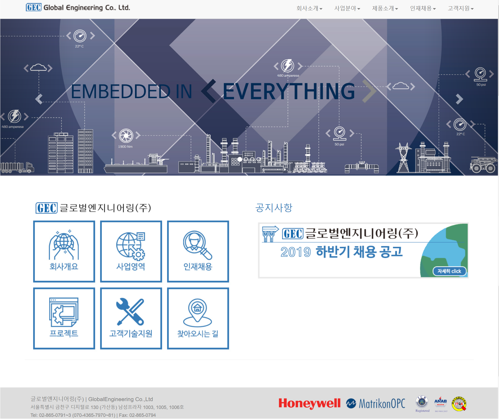

2017년 현장실습 기업 사이트 제작
=============
## 사용 라이브러리
* Bootstrap, phpmailer

## 기능 및 구성설명
* html과 php를 활용해 구현
* 구글 smtp를 활용, 메일 발송이 가능 한 form 구현
* db테이블을 로드해 게시판 구성
* 게시글 선택시 해당 게시글의 내용을 보여줌
* pdf파일 다운로드 가능

## 현재 서비스중인 사이트
<http://www.gdsenc.com/>

## 개인적소감

웹에 대해서 아무것도 몰랐던 시절 맨땅에 헤딩으로 어렵게 작업했던 결과물이다.
지금보면 정말 잘못된 부분이 하나부터 열까지 끝이없지만,
당시에는 저렇게 구현하는거 조차도 쉽지않았었다.
코드 리뷰를 하며 되짚어보니 고치고 싶은 부분이 너무많다.
지금의 내가 구현하면 어떨지 고민도 많이했다.
기회가 된다면 다시 작업해서 사이트를 서비스 시키고 싶다.

(저장소에 공개된 내용은 기업과 연관없는 소스코드 부분만 공개되어 있습니다. 
기업과 연관된 이미지와 자료는 모두 제외되어 있습니다.)
